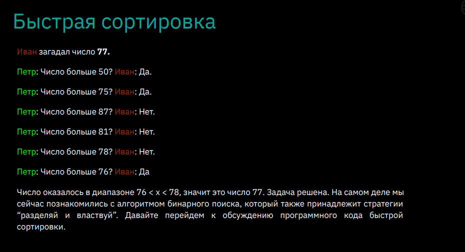

# Инфо(из лекции 1)

## Базовые типы данных **Python**

|<span style="color: green">int</span>|целые числа|
|-|-|
<span style="color: green">float</span>| Дробные числа|
<span style="color: green">bool</span>| Логический тип данных(True/false)|
<span style="color: green">str</span>| Строка|

## встроинные команды

1. `input()` — ввод данных с терминала
2. переменная **+=** число — +число
3. переменная **-=** число — -число
4. переменная ***=** число — *число
5. переменная **/=** число — /число
6. переменная **//=** число — //число
7. переменная **%=** число — %число
8. переменная **= число — **число 
9. `break` — остонавливает работу цикла   
10. `len()` — длина(можно узнать размер) 
11. `in` — в(например, можно узнать есть ли строка в списке)


## методы
1. `round()` — округление в большую сторону(можно указать кол-во знаков после запятой `round(arg, 3)`)
2. `.lower()` — переводит все символы в нижний регистр
3. `.upper()` — переводит все символы в верхний регистр
4. `.replace()` — замена. (пример .replace('еще', 'ЕЩЕ'))


## функции фишки...

1. `n = None` — пустая переменная<br><br>
2. `type()` — выводит(class) тип данных переменной <br><br>
3. `'какая то \' строка'` —  если хотим вывести одну ковычку в строке, используем `\`<br><br>
4. `#` — однострочный коментарий;<br>
`""" """` — многострочный коментарий;<br> 
`CTRL + K, CTRL + C` — коментарий состоящий из `#`(что-бы убрать `CTRL + K, CTRL + U`)<br><br>
5. **Интерполяция** 
   ```python
    a = 5
    b = 15
    c = 25
    print(a, ' - ',b, ' - ',c) #интерполяция(1 способ)
    print(f"{a} - {b} - {c}")  #интерполяция(2 способ)
    print("{} - {} - {}".format(a, b, c)) 
    ``` 
6. **тип данных(переменная)** — приведение типов <br><br>
7. Управляющая конструкция: `while-else`
    ```python
    while condition:
        тело
    else:
        тело    
    ```
    else выполняется, когда основное тело цикла перестает работать самаостоятельно.
    Если например использовать `break` то else не будет использоваться <br><br>
8. Цикл `for` — в python for в основном используется для перебора значений. <br>
    `range`
    * range выдает значения из диапозона с шагом 1.
    * если указать только одно число - от 0 до заданного числа.
    * если нужен другой шаг, третьим аргументом можно задать приращение. 
    ```python
    r = range(5) # 0 1 2 3 4  
    r = range(2, 5) # 2 3 4 
    r = range(0, -5) # ----
    r = range(1, 10, 2) # 1 3 5 7 9
    r = range(100, 0, -20) # 100 80 60 40 20
    r = range(5) # 0 1 2 3 4 5     
    ``````
    *шаг по умолчания +1. Если нужно идти в отрицательную сторону нужно указать нужный шаг* <br><br>
9. срезы:
    ```python
    text = 'съешь еще этих мягких французских булок'
    print(text[0]) # с
    print(text[1]) # ъ
    print(text[len(text)-1]) # к
    print(text[-1]) 
    print(text[:]) - все символы в строке
    print(text[:5]) - вывод элементов с 0 - 5
    print(text[3:]) - с 3 элемента до конца
    print(text[6:-18]) - можно использовать отрицательные числа
    print(text[0:len(tex):6]) - от 0 до конца с шагом 6
    print(text[::6])
    


    ``````
    *если в [] писать отрицательные значение то действия будут выполняться с конца строки...*
<br><br><br>

10. теория с семенара1

`sep` — добовляет символы между аргументов при выводе.

```python
n1 = 2
n2 = 3
if 1 > 0:
    print(f"{n1} > {n2}", 45, 45, sep = ' +++++ ') # 2 > 3 +++++ 45 +++++ 45
```

`end` — перевод строки в одну строку при выводе.

```python
n1 = 2
n2 = 3
if 1 > 0:
    print(f"{n1} > {n2}", 45, 45, sep = ' +++++ ', end = "\t")
    print(f"{n1} > {n2}", 45, 45, sep = ' +++++ ') # 2 > 3 +++++ 45 +++++ 45 2 > 3 +++++ 45 +++++ 45

    # or
    print(f"{n1} > {n2}", 45, 45, sep = ' +++++ ', end = "-----")
    print(f"{n1} > {n2}", 45, 45, sep = ' +++++ ') # 2 > 3 +++++ 45 +++++ 45-----2 > 3 +++++ 45 +++++ 45
   
```


# Инфо(из лекции 2)
# Колекции данных

## Списки 
**Список** - это упорядоченный конечный набор элементов. По сути список это тот же массив, в котором можно хранить элементы любых типов данных.

```Python
list_1 = [] # Создание пустого списка 
list_2 = list() # Создание пустого списка 
list_1 = [7, 9, 11, 13, 15, 17]
``````
* list() - функция для создания списка
``````Python
list_1 = [7, 9, 11, 13, 15, 17]
print(list_1) # [7, 9, 11, 13, 15, 17]

list_1 = [7, 9, 11, 13, 15, 17]
print(*list_1) # 7 9 11 13 15 17
``````
* если перед выводом списка поставить "*", это будет означать что мы отрываем список и в выводе не будут только значения списка.

*В списках существует нумерация, которая начинается с 0*

```Python
list_1 = [7, 9, 11, 13, 15, 17]
print(list_1[0]) # 7
``````

``````Python
for i in list_1: # вывод значений списка на экран
    print(i)
# 7
# 9
# 11
# 13
# 15
# 17
``````

`len()` - функция для нахождения количества элементов(размера)
``````Python
print(len(list_1)) # 6
``````
`append()` - добовляет элемент в конец списка
``````Python
list_1 = [1, 5]
print(list_1) # [1, 5]
list_1.append(8)
print(list_1) # [1, 5, 8]
``````
`pop` - удаляет последний элемент и возвращает его вне списка
``````Python
list_1 = [12, 7, -1, 21, 0]
print(list_1.pop()) # удаление 0
print(list_1) # [12, 7, -1, 21]
print(list_1.pop()) #удаление 21
print(list_1) # [12, 7, -1]
print(list_1.pop()) #удаление -1
print(list_1) # [12, 7]

# удаление конкретного элемента из списка 
list_1 = [12, 7, -1, 21, 0]
print(list_1.pop(0)) # 12
print(list_1) # [7, -1 , 21, 0]
``````

`insert(позиция, значение)` - вставляет элемент в список на нужную позицию
``````Python
list_1 = [12, 7, -1, 21, 0]
print(list_1.insert(2, 11))
print(list_1) #[12, 7, 11, -1, 21, 0]
`````` 
`Срезы`
``````Python
list_1 = [1, 2, 3, 4, 5, 6, 7, 8, 9, 10]
print(list_1[0]) # 1
print(list_1[1]) # 2
print(list_1[len(list_1)-1]) # 10
print(list_1[-5]) # 6
print(list_1[:]) # [1, 2, 3, 4, 5, 6, 7, 8, 9, 10]
print(list_1[:2]) # [1, 2]
print(list_1[len(list_1)-2:]) # [9, 10]
print(list_1[2, 9]) # [3, 4, 5, 6, 7, 8, 9]
print(list_1[6, -18]) # []
print(list_1[0:len(list_1):6]) # [1, 7]
print(list_1[::6]) # [1, 7]
``````

## Кортежи

**Кортеж - это неизменяемый список.**<br>
*Кортежи нужны для защиты каких-либо данных от изменений. Кортеж занимает меньше места в памяти и работает быстрее чем список*

``````Python
t = () # создание пустого картежа 
print(type(t)) # <class 'tuple'>

t = (1,)
print(type(t)) #<class 'tuple'>

t = (28, 9, 1990,)
print(type(t)) #<class 'tuple'>
``````
* важно ставить запятую после значения, иначе тип данных изменится

``````Python
g = (1, 3, 5,)
x,y,z = g
print(x, y, z) # 1 3 5
``````
* распоковка картежа

``````Python
g = (1, 3, 5, 7,)
print(g[1]) # 3
``````
``````Python
g = (1, 3, 5, 7,)
for i in g:
    print(i) 
# 1
# 3
# 5
# 7

# или

g = (1, 3, 5, 7,)
for i in range(len(g)):
    print(g[i])
# 1
# 3
# 5
# 7
``````

## Словари
**Словари - неупорядочеунные коллекции приизвольных объектов с доступом по ключу** 

*В списках в качестве ключа используется индекс элемента. В словаре для опеделения элемента используется значение ключа*

``````Python
d = {} # создание пустого словаря
d = dict() # создание пустого словаря

d = {} # создание пустого словаря
d['q'] = 'qwerty' # ключ значение
d['w'] = 'werty' # ключ значение
print(d) #{'q': 'qwerty', 'w': 'werty'}
print(d['q']) # qwerty
d[5] = 12345
print(d)
print(d[5]) # 12345
`````` 


* если выводить сам словарь то выводятся все ключи и значения в словаре, если выводить ключи выводится значение этого ключа
* в словаре могут храниться любые типы данных...

`del` - удаление элемента из словаря
``````Python
d = {} # создание пустого словаря
d['q'] = 'qwerty' # ключ значение
d['w'] = 'werty' # ключ значение
del d['q'] # удоление элемента из словаря
print(d) #{'w': 'werty'}
`````` 
``````Python
dictionary = {1: 1234, 2:545, 3:1234, 4:"qwerty"}
for i in dictionary:
    print(i)
# 1
# 2
# 3
# 4
    print(dictionary[i])
# 1234
# 545
# 1234
# qwerty
`````` 

`.items()` - это метод словаря, который возвращает представление пар ключ-значение словаря в виде кортежей.
``````Python
dictionary = {1: 1234, 2:545, 3:1234, 4:"qwerty"}
print(dictionary.items()) # dict_items([(1, 1234), (2, 545), (3, 1234), (4, 'qwerty')])
for (k, v) in dictionary.items():
    print(k, v)
# 1 1234
# 2 545
# 3 1234
# 4 qwerty
`````` 

## Множества
**множества содержат в себе уникальные элементы, не обязательно упорядоченные.**

*Одно множество может содержать значения любых типов. С двумя множествами можно совершать любые стандартные операции, например, объединение, пересечение и разность.*

`.add()` - добовляет элемент в множество

`.remove` - удаляет значение из множества

`.clear` - удаляет все значения из множества
``````Python
s = {'tr', 'gr', 'gt'} # множество
print(s) #{'gt', 'gr', 'tr'}
s.add('af')
print(s) #{'tr', 'af', 'gt', 'gr'}
s.remove("af")
print(s)
s.clear()
print(s) #set()

q = set() # пустое множество
``````
`.discard()` - проверяет есть ли значение в множестве, если есть, то удаляет, если нет, то пропускает.
``````Python
s = {'tr', 'gr', 'gt'}
print(s)
s.add('af')
print(s)
s.discard('af')
print(s)
# {'gt', 'tr', 'gr'}
# {'af', 'gt', 'tr', 'gr'}
# {'gt', 'tr', 'gr'}
``````
#### Операции над множествами

`copy` - создает и возвращает копию объекта. 
`.union()` - уникальные значения из множества a и b(объединения)
`intersection()` - одинаковые значения из a и b(пересечения)
`.difference()` - разница между значениями множеств
``````Python
a = {1, 3 , 4, 7, 8}
b = {6, 2 , 9, 11, 12}
c = a.copy()
print(a, b, c) # {1, 3, 4, 7, 8} {2, 6, 9, 11, 12} {1, 3, 4, 7, 8}
p = a.union(b)
print(p) # {1, 2, 3, 4, 6, 7, 8, 9, 11, 12}
g = b.intersection(a)
print(g) # set()
m = a.difference(b)
print(m) # {1, 3, 4, 7, 8}
m2 = b.difference(a)
print(m2) #{2, 6, 9, 11, 12}
``````
`fronzenset()` - замороженное множество(нельзя изменять)
``````Python
a = {1, 2, 3}
b= frozenset(a)
print(b) # frozenset({1, 2, 3})
``````

## List Compretion 
**list compretion** — генератор списка
```python
    # Создать список, состоящий из четных чисел в диапазоне от 1 до 100.
list_1 = []
for i in range(1, 101):
    list_1.append(i)


    # или
list_1 = [i for i in range(1, 101)] # [1, 2, 3,..., 100]


    # только чётные числа

list_1 = [i for i in range(1, 101) if i % 2 == 0]# [2, 4, 6,..., 100]


    # Допустим, вы решили создать пары каждому из чисел (кортежи)
list_1 = [(i, i) for i in range(1, 101) if i % 2 == 0]# [(2, 2), (4, 4),..., (100, 100)]

    # Также можно умножать, делить, прибавлять, вычитать. Например, умножить значение на 2.
list_1 = [i * 2 for i in range(10) if i % 2 == 0]
print(list_1) 

```

## доп инф
#### Множественное присваивание
``````Python
a,b = 1, 2
print(a, b) # 1 2
`````` 
* можно таким образом инициальзировать переменные 

``````Python
t = [1, 3, 4]
print(t) # [1, 3, 4]
t[0] = 2
print(t) # [2, 3, 4]
`````` 

# Инфо (из лекции 3)
# Функции, рекурсия, алгоритмы

## Функции 
**Функция — это фрагмент программы, используемый многократно.**

```Python
def function_name(x): # создание функции
 # body line 1
 # ...
 # body line n
 # optional return
 ```
`def` — создание функции

`return` — возвращает значение из функции, **завершает функцию**.

```Python
def sumNumbers(n, y = "qwerty"): # передаём аргумент y но не вызываем его
    print(y)
    sum = 0
    for i in range(1, n+1):
        sum += i 
    return sum

a = (sumNumbers(5))
print(a) 


def sumNumbers(n, y = "qwerty"): # передаём аргумент и вызываем его
    print(y)
    sum = 0
    for i in range(1, n+1):
        sum += i 
    return sum

a = (sumNumbers(5, y = "ffff"))
print(a) 
```

```Python
def sum_str(*args): 
    res = ''
    for i in args:
        res += i
    return res

print(sum_str('q', 'w', 'e', 'r', 't', 'y'))
```
`(*args)` — с помощью * можем передовать неограниченное кол-во аргументов 

## Модульность

* если в одном файле сохранить функции, то этот файл с функциями можно вызвать в другом файле. С помощью `import`

```Python
# 1 СПОСОБ
#создаём в 1 файле
def max1(a, b):
    if a > b:
        return a
    return b

#запускаю во 2 файле
import modul
print(modul.max1(5, 9)) 

# 2 СПОСОБ
#создаём в 1 файле
def max1(a, b):
    if a > b:
        return a
    return b

#запускаю во 2 файле
from modul import max1
print(max1(5, 9)) 
```

```Python
from modul import * # импортируем все функции из файла modul
print(max1(10, 9))
```

```Python
import modul as m1 # на время можно изменить имя импортируемого файла
print(m1.max1(10, 9))
```

## Рекурсия

**Рекурсия — это функция, вызывающая сама себя.**

*При описании рекурсии важно указать, когда функции надо остановиться и
перестать вызывать саму себя. По-другому говоря, необходимо указать базис
рекурсии*

```python
def fib(n):  # последовательность фибоначчи 
    if n in [1, 2]:
        return 1
    return fib(n - 1) + fib(n - 2)

list_1 = []
for i in range(1, 10):
    list_1.append(fib(i))
print(list_1)
```

## Алгоритмы 

**Алгоритмом называется набор инструкций для выполнения
некоторой задачи.**

* **Быстрая сортировка** — Быстрая сортировка принадлежит такой стратегии, как “разделяй и властвуй”. 
 
 

```Python
# Два друга решили поиграть в игру: один загадывает число от 1 до 100, 
#другой должен отгадать.

def quit_sort(array):
    if len(array) <= 1:
        return array
    else:
        pivot = array[0]
    less = [i for i in array[1:] if i <= pivot]
    greater = [i for i in array[1:] if i > pivot]
    return quit_sort(less) + [pivot] + quit_sort(greater)

print(quit_sort([14, 5, 9, 1, 3, 4, 5, 6])) # [1, 3, 4, 5, 5, 6, 9, 14]
```

* **Сортировка слиянием —** 
```Python
def merge_sort(nums):
    if len(nums) > 1:
        mid = len(nums) // 2
        left = nums[:mid]
        right = nums[mid:]
        merge_sort(left)
        merge_sort(right)
        i = j = k = 0
        while i < len(left) and j < len(right):
            if left[i] < right[j]:
                nums[k] = left[i]
                i += 1
            else:
                nums[k] = right[j]
                j += 1
            k += 1

        while i < len(left):
            nums[k] = left[i]
            i += 1
            k += 1

        while j < len(right):
            nums[k] = right[j]
            j += 1
            k += 1

list1 = [1, 3, 5, 7, 65, 6, 66, 345, 5435, 543, 4]
merge_sort(list1)
print(list1)  # [1, 3, 4, 5, 6, 7, 65, 66, 345, 543, 5435]
```

# Инфо (из лекции 4)
# Функции высшего порядка, работа с файлами.

```Python
# обычная функция
def f(x):
    return x * x

print(f(5)) # 25


# обычная функция 2 — если вызвать функцию
def f(x):
    return x * x

print((f)) # <function f at 0x000001D2B6025940>


# обычная функция 3 — функция можно переписать в отдельную переменную
def f(x):
    return x * x


a = f
print(a(5)) # 25
```

```Python
# вызов функции через функцию
def cal1(a, b):
    return a + b

def cal2(a, b):
    return a * b

def math(op, x, y):
    print(op(x, y))

math(cal2, 5, 3) # 15
math(cal1, 5, 3) #8
```

```Python
## lambda функция - тоже самое что и обычная функция, но кароче

# def cal1(a, b):
#     return a + b

cal1 = lambda a,b: a + b

print(cal1(3, 5)) # 8


# еще более короткая функция

def math(op, x, y):
    print(op(x, y))

math(lambda a,b: a + b, 3, 8) 
```

```Python
# 1. В списке хранятся числа. Нужно выбрать только чётные числа и составить список пар
# (число; квадрат числа).
# Пример: 1 2 3 5 8 15 23 38
# Получить: [(2, 4), (8, 64), (38, 1444)]


# 1 способ
# data = [1, 2, 3, 5, 8, 15, 23, 38]
# res = list()

# for i in data:
#     if i % 2 == 0:
#         res.append((i, i ** 2))
# print(res)


# 2 способ
# my_list = [1, 2, 3, 5, 8, 15, 23, 38]
# my_list_res = list()

# def chet(x):
#     for i in my_list:
#         if i % 2 == 0:
#             my_list_res.append((i, i ** 2))
#     print(my_list_res)

# chet(my_list)


# 3 способ — пока что не упрощенный вид:
# def select(f, col):
#     return [f(x) for x in col]

# def where(f, col):
#     return [x for x in col if f(x)]  

# data = [1, 2, 3, 5, 8, 15, 23, 38]

# res = select(int, data) 
# print(res)              
# res = where(lambda x: x % 2 == 0, res)
# print(res)
# res = list(select(lambda x: (x, x ** 2), res))
# print(res)


# У нас есть две функции: select и where.

# Функция select принимает два аргумента: функцию f и список col. Она применяет функцию f к каждому элементу списка col и возвращает новый список, содержащий результаты применения функции f к каждому элементу.

# Функция where также принимает два аргумента: функцию f и список col. Она фильтрует элементы списка col, оставляя только те, для которых функция f возвращает True.

# У нас есть список данных data: [1, 2, 3, 5, 8, 15, 23, 38].

# Мы сначала применяем функцию select к данным data и получаем новый список res, в котором каждый элемент является целым числом.

# После этого мы используем функцию where для фильтрации списка res и оставляем только четные числа.

# Далее мы преобразуем список res, используя лямбда-функцию, чтобы каждый элемент стал кортежем, содержащим исходный элемент и его квадрат.

# Наконец, мы печатаем полученный результат res.

# 4 способ
data = [1, 2, 3, 5, 8, 15, 23, 38]
res = map(int, data)
res = filter(lambda x: x % 2 == 0, res)
res = list(map(lambda x: (x, x ** 2), res))
print(res)
```

## функция map
**Функция map в Python предназначена для применения заданной функции к каждому элементу итерируемого объекта (например, списку) и возвращает новый итератор с результатами применения этой функции.**

* Синтаксис функции map — *map(функция, итерируемый объект)*

```Python
numbers = [1, 2, 3, 4, 5]
result = list(map(lambda x: x + 1, numbers))
print(result) #[2, 3, 4, 5, 6]
```


```Python
# Задача: C клавиатуры вводится некий набор чисел, в качестве разделителя используется
# пробел. Этот набор чисел будет считан в качестве строки. Как превратить list строк в list чисел?

data = "15 34 32 65 633 124 43 54"

data = list(map(int, data.split()))
print(data) # [15, 34, 32, 65, 633, 124, 43, 54]
```

## функция filter

**Функция filter() применяет указанную функцию к каждому элементу итерируемого объекта и
возвращает итератор с теми объектами, для которых функция вернула True.**

```Python
data = [15,  65, 9, 36, 175]

res = list(filter(lambda x: x % 10 == 5, data))
print(res) # [15, 65, 175]
```

## функция zip

**Функция zip() применяется к набору итерируемых объектов и возвращает итератор с кортежами
из элементов входных данных**

```Python
list1 = [1, 2, 3]
list2 = ['a', 'b', 'c']
result = list(zip(list1, list2))
print(result) #[(1, 'a'), (2, 'b'), (3, 'c')]
```

```Python
# если в одном списке меньше данных чем в других, то конечный результат будет основан на этом списке... 

u = ['user1', 'user2', 'user3', 'user4', 'user5']
i = [4, 5, 9, 14, 7]
s = [111, 222, 333]
data = list(zip(u, i, s))
print(data) #[('user1', 4, 111), ('user2', 5, 222), ('user3', 9, 333)]
```

## функция enumerate

**Функция enumerate() применяется к итерируемому объекту и возвращает новый итератор с
кортежами из индекса и элементов входных данных.**

```Python
# выведем список состоящий из индекса и значения этого индекса 
t = ['t', 'g', 'h']
t = list(enumerate(t))
print(t) #[(0, 't'), (1, 'g'), (2, 'h')]
```

## файлы

* **Файлы в текстовом формате используются для:**<br>
● Хранения данных<br>
● Передачи данных в клиент-серверных проектах<br>
● Хранения конфигов<br>
● Логирования действий
Что нужно для работы с файлами:
1. Завести переменную, которая будет связана с этим текстовым файлом.
2. Указать путь к файлу.
3. Указать, в каком режиме мы будем работать с файлом.<br>

* **Варианты режима (мод):**<br>
**a** – открытие для добавления данных.<br>
○ Позволяет дописывать что-то в имеющийся файл.<br>
○ Если вы попробуете дописать что-то в несуществующий файл, то файл будет создан
и в него начнется запись.<br>
**r** – открытие для чтения данных.<br>
○ Позволяет читать данные из файла.<br>
○ Если вы попробуете считать данные из файла, которого не существует, программа
выдаст ошибку.<br>
**w** – открытие для записи данных.<br>
○ Позволяет записывать данные и создавать файл, если его не существует.<br><br>


* **Миксованные режимы:**
1. **w+**<br>
○ Позволяет открывать файл для записи и читать из него.<br>
○ Если файла не существует, он будет создан.<br>
2. **r+**<br>
○ Позволяет открывать файл для чтения и дописывать в него.<br>
○ Если файла не существует, программа выдаст ошибку.

```Python
# пример работы с файлом 1
colors = ['red', 'green', 'blue']
data = open('file.txt', 'a') # режим в котором будем работать
data.writelines(colors) # разделителей не будет 
data.close() 

# пример работы с файлом 2
with open('file.txt', 'w') as data: # в созданном файле все стирается и добавляется новая информация.
    data.write('line 1\n')
    data.write('line 2\n') 
print(56)

# пример работы с файлом 3
path = 'file.txt'
data = open('file.txt', 'r') # выведется информация из файла file.txt в интерпритатор
for line in data:
    print(line)
data.close()
```

## Модуль os

**Модуль os предоставляет множество функций для работы с операционной системой, причем их
поведение, как правило, не зависит от ОС, поэтому программы остаются переносимыми.**

*Для того, чтобы начать работать с данным модулем необходимо его импортировать в свою
программу:  — **import os**

`os.chdir(path)` - смена текущей директории.

```Python
# пример работы библиотеки:
import os
os.chdir('C:/Users/79190/PycharmProjects/GB')
```

`os.getcwd()` - текущая рабочая директория

```Python
import os
print(os.getcwd()) # 'C:\Users\79190\PycharmProjects\webproject'
# при вводе этой команды, сможем получить путь к нашей рабочей директории
```

`os.path` - является вложенным модулем в модуль os и реализует некоторые полезные функции для работы с путями, такие как:<br>
○ **os.path.basename(path)** - базовое имя пути

```Python
import os
print(os.path.basename('C:/Users/79190/PycharmProjects/webproject/main.py')) #'main.py'
```
○ **os.path.abspath(path)** - возвращает нормализованный абсолютный путь.

```Python
import os
print(os.path.abspath('main.py')) # 'C:/Users/79190/PycharmProjects/webproject/main.py'
```

## Модуль  shutil

**Модуль shutil содержит набор функций высокого уровня для обработки файлов, групп файлов, и папок. В частности,
доступные здесь функции позволяют копировать, перемещать и удалять файлы и папки. Часто используется вместе
с модулем os.**

*Для того, чтобы начать работать с данным модулем необходимо его импортировать в свою программу:
import shutil*

 **базовые функции данного модуля:**

● **shutil.copyfile(src, dst)** - копирует содержимое (но не метаданные) файла src в файл dst.<br>
● **shutil.copy(src, dst)** - копирует содержимое файла src в файл или папку dst.<br>
● **shutil.rmtree(path)** - Удаляет текущую директорию и все поддиректории; path должен указывать на
директорию, а не на символическую ссылку(с этой командой нужно работать АКУРАТНО, т.к можно случайно повредить файлы компьютера)

# Инфо (из лекции 5)
# Google Colad(Jupyter). Знакомство с аналитикой

## Базовые функции для работы с данными
**Библиотека pandas** может читать многие форматы, включая: .csv,
.xslx, .xls, .txt, sql и многие другие. 

Чтобы подключить библиотеку к Вашей программе необходимо
написать следующее:
`import pandas as pd`
Напоминание: as(alias) - псевдоним. Мы можем сократить название
все библиотеки до 2-х букв.
Прочтем файл .csv(он находится в Google Colab в папке sample_data) с
помощью библиотеки pandas
`df = pd.read_csv('sample_data/california_housing_train.csv')`

**команды для вывода данных в google colab:**<br>
1. `.read()` — считывает данные из файла
2. `head()` — выводит первые элементы файла. в () можно указать кол-во элементов
3. `.tail()` — выводит последние элементы файла. в () можно указать кол-во элементов
4. `.shape` — выводит кол-во строк и столбцов
5. `.isnull()` — проверяет есть ли у нас не заполненные ячейки таблицы(если нет то False, если есть то True)
6. `.isnull().sum()` — подсчитывает сумму и выводит результат(если есть не заполненные ячейки то будет 1 иначе 0) данный способ работает быстрее чем просто `.isnull()`
7. `.dtypes` — выводит тип данных 
8. `.columns` — название всех столбцов 
9. `['название столбца, название столбца2']` — вывод данных из задонного(-ых) столбца(-ов) 
10. `&` — and
11. `|` — or    

```python
import pandas as pd
df = pd.read_csv('sample_data/california_housing_train.csv')
df.head() 
df.tail() 
df.shape
df.isnull()
df.isnull().sum() 
df.dtypes
df.columns 
# выборака данных
df['latitude']

#задание: вывести столбец total_rooms, у которого возраст здания(housing_median_age) < 20. 
df[df['housing_median_age'] < 20]['total_rooms'] 

#+
df[(df['housing_median_age'] < 20) & (df['housing_median_age'] > 10)]['total_rooms'] 

df[(df['housing_median_age'] < 20) & (df['housing_median_age'] > 10)][['total_rooms', 'housing_median_age', 'population', 'longitude']]

#простая статистика
print(df['population'].max()) #максимальное значение столбца
print(df['population'].min())
print(df['population'].mean()) #среднее значение столбца
print(df['population'].sum()) #сумма всех значений 
print(df['population'].median()) #среднее орефметическое  
df.describe() # вывод всей вышеперечисленной статистики 
```  

**Библиотека seaborn** — отображает граффики из таблиц, принимает библиотеку pandas
1. `Scatterplot` — Точечный график
2. `` — 

```Python
import seaborn as sns
sns.scatterplot(data=df, x="longitude", y="latitude")
sns.scatterplot(data=df, x="households", y="population", hue="total_rooms", size=10)

#2 вывод всех возможных граффиков 
cols = ['population', 'median_income', 'housing_median_age', 'median_house_value']
g = sns.PairGrid(df[cols])
g.map(sns.scatterplot) 
```
